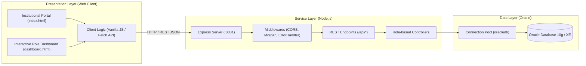

# SIGPA — Academic Internship Management System 🎓

[](https://nodejs.org/)
[](https://expressjs.com/)
[](https://www.oracle.com/database/)
[](https://developer.mozilla.org/)
[](https://www.udi.edu.co/)

**SIGPA** (*Sistema Integral de Gestión de Prácticas Académicas*) is an enterprise-grade full-stack web application developed for **Universidad de Investigación y Desarrollo (UDI)**. It centralizes, automates, and monitors the entire lifecycle of student academic internships and pre-professional practicums.

The platform connects Program Directors, Academic Tutors, Institutional On-Site Advisors, and Students in real time—ensuring complete auditability, logbook validation, and institutional compliance.

---

## 🏛️ System Architecture

The platform follows a decoupled, three-tier architecture ensuring separation of concerns, scalability, and maintainability:



---

## 👥 Modules & Role-Based Access

| Role | Scope & Responsibilities |
| :--- | :--- |
| **Program Director** | General administration, institutional partnership management, placement configuration, and macro-level KPI reporting. |
| **Academic Tutor** | Pedagogical supervisor; validates accumulated student hours, oversees weekly progress, and submits official grading. |
| **On-Site Advisor** | In-situ supervisor at the host institution; verifies physical attendance and provides endorsement for student logbooks. |
| **Student Intern** | Practicum candidate; consults assigned placements, submits regular activity logbooks with digital evidence, and tracks approved hours. |

---

## 📁 Repository Structure

```text
sigpa_app/
├── backend-node/           # Backend REST API built with Node.js and Express
│   ├── src/
│   │   ├── config/         # Oracle connection pool and automated DDL setup scripts
│   │   ├── controllers/    # Business logic segregated by system role
│   │   ├── middlewares/    # Centralized error handling and security policies
│   │   ├── routes/         # REST API routes (/api/auth, /api/estudiante, etc.)
│   │   └── app.js          # Express entrypoint with Fail-Fast DB connection checks
│   ├── .env.example        # Environment variables template
│   └── package.json        # Dependencies (oracledb, express, cors, dotenv)
│
├── frontend/               # Responsive client-side web application
│   ├── css/
│   │   └── style.css       # Modern CSS3 stylesheet with institutional UDI branding
│   ├── js/
│   │   └── app.js          # REST API consumption, DOM state management, and validations
│   ├── index.html          # Institutional landing and multi-role authentication portal
│   └── dashboard.html      # Dynamic dashboard tailored to each authenticated role
│
└── database/
    └── schema.sql          # Complete Oracle DDL: tables, constraints, foreign keys, and seeds
```

---

## 🚀 Getting Started (Local Setup)

### 1. Prerequisites
* **Node.js** v18 or higher installed.
* Active **Oracle Database** instance (10g, 11g, 19c, or Oracle Database XE).

### 2. Backend Configuration
Navigate to the backend directory and install dependencies:

```bash
cd backend-node
npm install
```

Create your local environment file from the template:
```bash
cp .env.example .env
```

Configure your Oracle connection credentials in `.env`:
```env
PORT=8081
DB_USER=your_oracle_user
DB_PASSWORD=your_oracle_password
DB_CONNECT_STRING=localhost:1521/XE
```

### 3. Database Initialization
Run the automated setup script to verify connectivity and create required DDL tables in Oracle:
```bash
npm run setup-db
```

### 4. Run the Application
Start the server in development mode with live reload:
```bash
npm run dev
```

* **Web Application:** Open `http://localhost:8081` in your browser.
* **Database Health Check:** `http://localhost:8081/api/test-db`

---

## 🛡️ Engineering Highlights & Best Practices
* **Connection Pooling:** Efficient, concurrent database access using `oracledb.createPool`.
* **Fail-Fast Architecture:** The server strictly validates Oracle database connectivity at boot time before accepting any HTTP requests.
* **Separation of Concerns (SoC):** Strict isolation between data persistence, business logic, and client-side presentation.
* **Secure Environment:** Sensitive credentials and connection strings are isolated via `.env` (strictly excluded from Git tracking).

---

## 👨‍💻 Authors & Acknowledgments
Capstone Integrator Project developed for **Universidad de Investigación y Desarrollo (UDI)**:
* **Andrés Sequeda** ([@FlipSv](https://github.com/FlipSv))
* **Santiago Acevedo**
