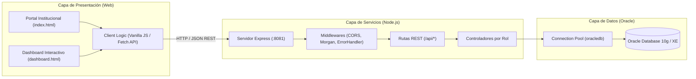

# SIGPA — Sistema Integral de Gestión de Prácticas Académicas 🎓

[](https://nodejs.org/)
[](https://expressjs.com/)
[](https://www.oracle.com/database/)
[](https://developer.mozilla.org/)
[](https://www.udi.edu.co/)

**SIGPA** es una plataforma web completa desarrollada para la **Universidad de Investigación y Desarrollo (UDI)** diseñada para automatizar, supervisar y centralizar todo el ciclo de vida de las prácticas académicas y pre-profesionales de los estudiantes.

El sistema conecta en tiempo real a directores, tutores académicos, asesores institucionales y estudiantes, garantizando transparencia en el registro de horas, aprobación de bitácoras y gestión documental.

---

## 🏛️ Arquitectura del Sistema

El proyecto está diseñado bajo una arquitectura desacoplada en tres capas principales:



---

## 👥 Módulos y Roles

| Rol | Alcance y Responsabilidades |
| :--- | :--- |
| **Director de Programa** | Administración general, gestión de convenios con instituciones, configuración de prácticas, métricas y KPIs globales. |
| **Tutor Académico** | Supervisión pedagógica, revisión y validación de horas y calificaciones finales de las prácticas asignadas. |
| **Asesor In-Situ** | Evaluación del practicante en la institución receptora y aval de bitácoras presenciales. |
| **Estudiante Practicante** | Consulta de asignaciones, registro periódico de bitácoras con evidencias y seguimiento de horas acumuladas. |

---

## 📁 Estructura del Repositorio

```text
sigpa_app/
├── backend-node/           # Backend API desarrollado en Node.js y Express
│   ├── src/
│   │   ├── config/         # Configuración del pool de Oracle y scripts DDL
│   │   ├── controllers/    # Lógica de negocio segmentada por rol
│   │   ├── middlewares/    # Manejo centralizado de errores y seguridad
│   │   ├── routes/         # Endpoints REST expuestos (/api/auth, /api/estudiante, etc.)
│   │   └── app.js          # Punto de entrada y servidor Express con política Fail-Fast
│   ├── .env.example        # Plantilla de variables de entorno
│   └── package.json        # Dependencias del servidor (oracledb, express, cors, dotenv)
│
├── frontend/               # Aplicación cliente web (Single Page / Multi-view)
│   ├── css/
│   │   └── style.css       # Estilos con diseño institucional UDI y componentes modernos
│   ├── js/
│   │   └── app.js          # Consumo de API REST, renderizado reactivo y validaciones
│   ├── index.html          # Portal institucional de bienvenida y autenticación
│   └── dashboard.html      # Panel interactivo según el rol autenticado
│
└── database/
    └── schema.sql          # Script DDL completo de tablas, restricciones e índices
```

---

## 🚀 Puesta en Marcha (Instalación Local)

### 1. Prerrequisitos
* **Node.js** v18 o superior instalado.
* Instancia activa de **Oracle Database** (10g, 11g, 19c o Oracle XE).

### 2. Configuración del Backend
Accede a la carpeta del servidor y prepara las variables de entorno:

```bash
cd backend-node
npm install
```

Copia el archivo de ejemplo para crear tu configuración local:
```bash
cp .env.example .env
```

Configura tus credenciales de Oracle en `.env`:
```env
PORT=8081
DB_USER=tu_usuario_oracle
DB_PASSWORD=tu_password_oracle
DB_CONNECT_STRING=localhost:1521/XE
```

### 3. Inicialización de la Base de Datos
Ejecuta el script para verificar o crear automáticamente las tablas en Oracle:
```bash
npm run setup-db
```

### 4. Ejecutar la Aplicación
Inicia el servidor en modo desarrollo:
```bash
npm run dev
```

* **Frontend Web:** Abre `http://localhost:8081` en tu navegador.
* **Test / Diagnóstico de BD:** `http://localhost:8081/api/test-db`

---

## 🛡️ Buenas Prácticas Implementadas
* **Connection Pooling:** Uso eficiente de conexiones concurrentes a través de `oracledb.createPool`.
* **Fail-Fast Policy:** El servidor valida la integridad y conectividad con la base de datos antes de aceptar peticiones HTTP.
* **Separación de Responsabilidades (SoC):** Desacoplamiento estricto entre capa de datos, lógica de negocio y presentación.
* **Seguridad:** Variables sensibles aisladas mediante `.env` (excluidas del control de versiones).

---

## 👨‍💻 Autores
Proyecto Integrador desarrollado para la **Universidad de Investigación y Desarrollo (UDI)**:
* **Andrés Sequeda** ([@FlipSv](https://github.com/FlipSv))
* **Santiago Acevedo**
